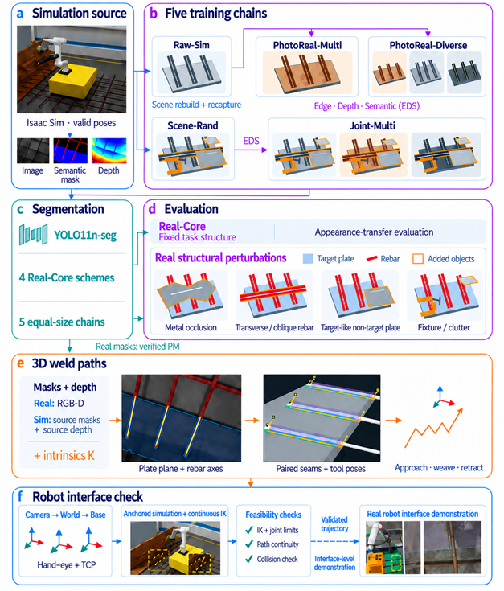
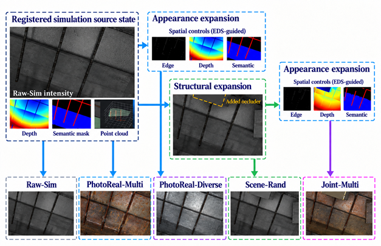
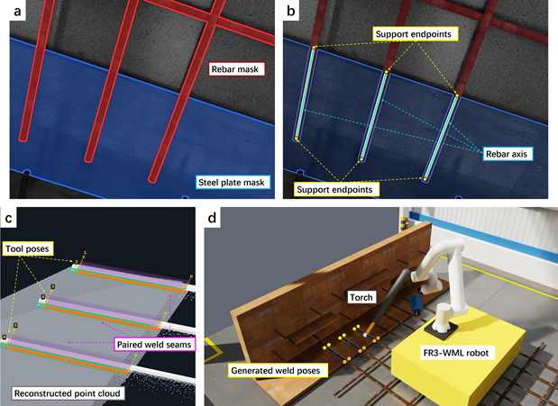
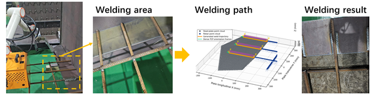

# 🤖 Task-Registered Robotic Welding Framework

A task-registered multi-chain synthetic-data framework for **sim-to-real visual perception and downstream weld-path generation in robotic rebar-to-plate welding**.

This research studies how synthetic data can be expanded across **appearance** and **structural** variations while preserving task semantics, geometric information, and robot states required for downstream robotic interfaces.

> 📄 **Research status:** A first-author manuscript based on this project is currently in final preparation for submission.  
> This repository currently serves as a research portfolio and technical overview.

---

## 🔍 Overview

Robotic welding in semi-structured environments is challenging because metallic reflections, rust, non-uniform illumination, occlusions, and scene-structure changes can create substantial gaps between simulated and real-world visual data.

This project develops a **task-registered synthetic-data framework** in NVIDIA Isaac Sim.

Each registered observation connects:

- intensity images
- semantic masks
- numerical depth
- point clouds
- camera parameters
- robot states
- task-object identities

Rather than treating synthetic images as isolated training samples, the framework keeps visual observations, supervision, 3D geometry, and robot configuration connected to the same registered scene state.

This makes it possible to introduce appearance and structural variations while keeping downstream geometry and task semantics traceable.

---

## 🧠 Overall Framework

<p align="center">
  
</p>

<p align="center">
  <i>Overall task-registered workflow connecting synthetic-data generation, visual learning, RGB-D geometry recovery, weld-path generation, and downstream robot interfaces.</i>
</p>

The overall workflow can be summarized as:

```text
Parameterized Isaac Sim Workcell
                ↓
       Registered Source State
                ↓
      Multi-Chain Data Expansion
                ↓
       Semantic Segmentation
                ↓
        Domain Evaluation
                ↓
        RGB-D Geometry Recovery
                ↓
          3D Weld Paths
                ↓
       Robot Interface Checks
```

---

## 🔗 Five Training Chains

<p align="center">
  
</p>

<p align="center">
  <i>Task-registered synthetic-data chains covering appearance expansion, structural expansion, and their combination.</i>
</p>

Five training chains are constructed from registered simulation states.

### Raw-Sim

Original Isaac Sim rendering with directly registered semantic labels, depth, point clouds, camera parameters, and robot states.

### PhotoReal-Multi

A controlled appearance-transfer chain designed to reduce the visual gap between simulation and real industrial scenes while preserving task-related structure.

### PhotoReal-Diverse

An extension of the PhotoReal pipeline that introduces broader appearance variations, including changes in metallic surface characteristics, illumination, reflection, and background appearance.

### Scene-Rand

A structural-randomization chain that explicitly modifies the **3D simulation scene** rather than adding objects in image space.

Structural disturbances may include:

- additional rebars
- non-target metal plates
- fixtures
- metallic clutter
- local occluders

Because the physical scene changes, image, depth, point cloud, semantic labels, and metadata are regenerated from the modified registered state.

### Joint-Multi

A combined chain in which structural expansion is performed first, followed by appearance expansion on the newly registered scene state.

---

## 🎯 Task-Registered Appearance Control

Appearance expansion is constrained using task-related information derived from the registered simulation state.

Three spatial controls are used:

- **Edge** — preserves local boundaries and object contours
- **Depth** — preserves spatial layout and front-back relationships
- **Semantic** — preserves task identities such as rebar and target plate

Together, these controls are used to reduce appearance-domain differences without intentionally changing the underlying task geometry.

Generated samples are also checked for structural consistency before inherited labels and geometric information are reused.

---

## 👁️ Visual Perception

The perception module uses an instance-segmentation model for two task classes:

- **Rebar**
- **Target plate**

Models trained from different synthetic-data chains are evaluated under multiple types of distribution shift, including:

- real industrial appearance
- structural disturbances
- configuration changes
- unseen task topologies

The goal is not only to improve segmentation performance, but also to understand which forms of synthetic-data variation are useful for different deployment conditions.

---

## 📊 Main Findings

The experiments show two important trends.

First, **controlled appearance expansion substantially improves transfer from simulated rendering to real welding images**.

Second, **explicit structural randomization improves robustness when the scene contains unseen objects, occlusion patterns, or structural disturbances**.

These observations suggest that **appearance shift and structural shift should be treated as distinct sources of sim-to-real generalization error**.

The experiments on unseen task topologies further indicate that different data-expansion strategies provide complementary benefits depending on the type of geometric change.

---

## 🧭 3D Weld-Path Generation

<p align="center">
  
</p>

<p align="center">
  <i>Semantic support and registered RGB-D geometry are used to recover rebar axes, the target-plate support plane, paired weld seams, and local tool poses.</i>
</p>

The downstream geometry pipeline combines semantic masks with registered depth and camera calibration.

```text
Semantic Masks
      ↓
Registered Depth
      ↓
Local 3D Point Cloud
      ↓
Rebar Axis Estimation
      ↓
Target-Plate Plane Fitting
      ↓
Paired Weld-Seam Generation
      ↓
Local Tool Poses
```

The main geometric operations include:

- mask-guided point-cloud extraction
- skeletonization and line detection
- robust target-plane fitting
- rebar-axis estimation
- paired seam generation
- local welding-tool orientation construction
- approach, welding, and retract pose generation

The segmentation mask is therefore not treated as the weld seam itself.

Instead, it provides semantic support for recovering task-relevant 3D geometry.

---

## 🤖 Robot Interface

Generated weld paths are transformed through:

**Camera Frame → World Frame → Robot Base Frame**

The downstream simulation interface includes:

- inverse kinematics
- joint-limit checking
- joint-space continuity checking
- path reachability
- simplified collision checking

The interface is used to verify that registered geometric information can be propagated consistently from perception into downstream robot kinematics.

<p align="center">
  
</p>

<p align="center">
  <i>Real RGB-D downstream demonstration from task-region perception to weld-path generation and robotic welding execution.</i>
</p>

A real RGB-D case was used to demonstrate the continuous data flow from:

**visual perception → task-region recovery → 3D weld-path generation → robot interface → welding execution**

The current work focuses primarily on **pipeline connectivity, task registration, and downstream interface integration**.

Full system-level validation of absolute weld-path accuracy, repeated execution performance, and weld quality remains future work.

---

## 🧪 Unseen Task Topologies

The framework is also evaluated on task structures that differ from the standard training assembly.

These include:

### Plate-to-Plate Joint

Tests whether the perception and geometric pipeline can transfer to adjacent plate structures and recover a meaningful joining region.

### Target Plate with a Through Hole

Tests whether the model can preserve target identity while distinguishing internal background regions.

### Curved Rebars

Tests whether rebar perception transfers from predominantly straight structures to nonlinear centerline geometry.

These experiments are used to study how appearance expansion and structural expansion behave under more substantial changes in task topology.

---

## 👩‍💻 My Role

My primary contributions to this research include:

- research design
- task-registered dataset organization
- multi-chain experimental design
- quality-control framework for generated samples and inherited labels
- experimental analysis and result organization
- manuscript preparation and scientific writing

This project was conducted collaboratively.

Team members also contributed to:

- Isaac Sim environment construction
- robotic welding data generation
- data processing
- semantic-segmentation experiments
- experimental organization
- visualization and documentation

---

## 🛠 Technologies

### Simulation & Robotics

- NVIDIA Isaac Sim
- robotic welding simulation
- forward and inverse kinematics
- coordinate-frame transformation
- robot trajectory validation

### Computer Vision

- YOLO segmentation
- OpenCV
- semantic and instance segmentation
- edge extraction

### 3D Perception

- RGB-D processing
- point-cloud reconstruction
- robust plane fitting
- rebar-axis estimation
- 3D geometric reasoning

### Synthetic Data

- task-registered synthetic-data generation
- spatially controlled image generation
- diffusion-based appearance generation
- image editing
- scene randomization
- Edge / Depth / Semantic constraints

### Programming

- Python

---

## 📄 Research Manuscript

**Task-Registered Multi-Chain Synthetic Data for Visual Learning and Weld-Path Generation in Robotic Rebar-to-Plate Welding**

**First author:** Weiran Wang

Status: **in final preparation for submission**

---

## 🔒 Code & Data Availability

The complete research release is planned together with the corresponding publication.

The future release is expected to include selected materials related to:

- registered simulation data
- spatial-control information
- appearance-expanded images
- label-verification results
- structural-perturbation test data
- unseen-topology test data
- prediction and evaluation results
- point-cloud weld paths
- robot trajectories
- source-record metadata
- simulation data collection
- semantic-mask generation
- image translation
- point-cloud reconstruction
- coordinate transformation
- inverse kinematics
- robot-interface validation

Until publication, this repository primarily serves as a **research portfolio and technical overview** of the project.

---

## 📬 Contact

**Weiran Wang**  
Beijing University of Technology  
Mechanical Engineering  
Second Bachelor's Degree in Computer Science and Technology
